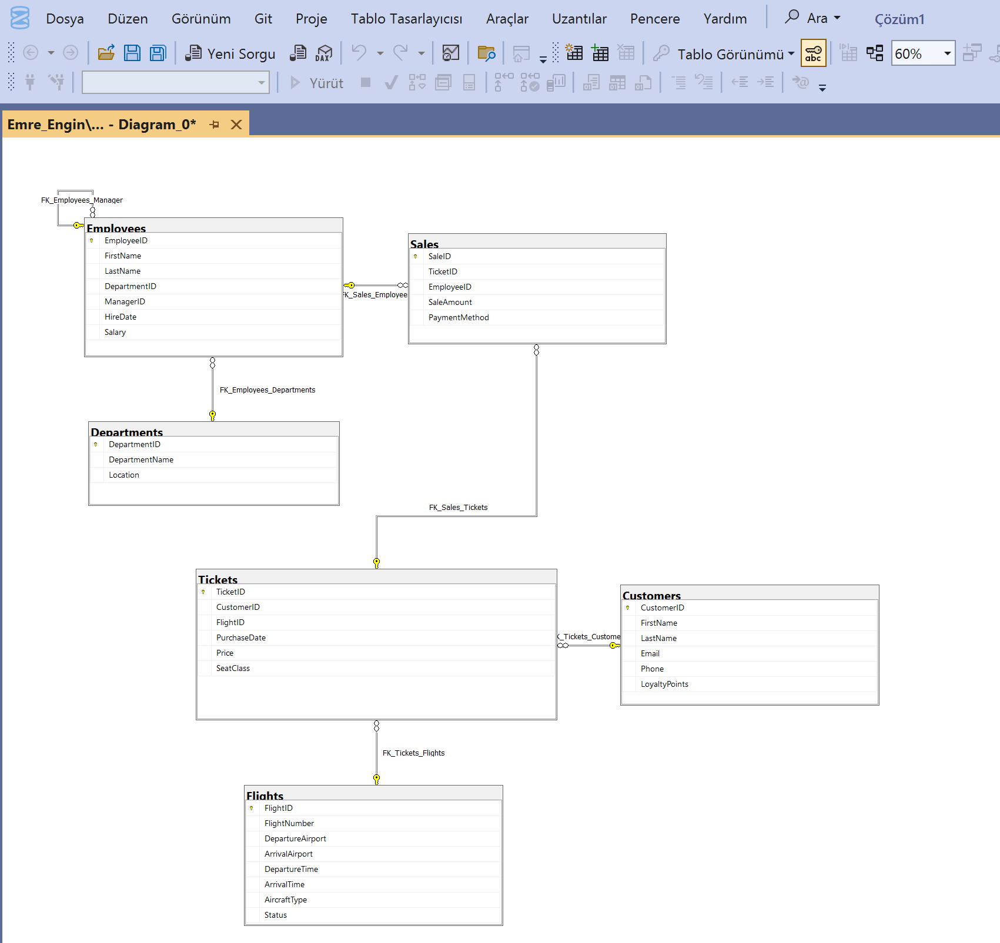
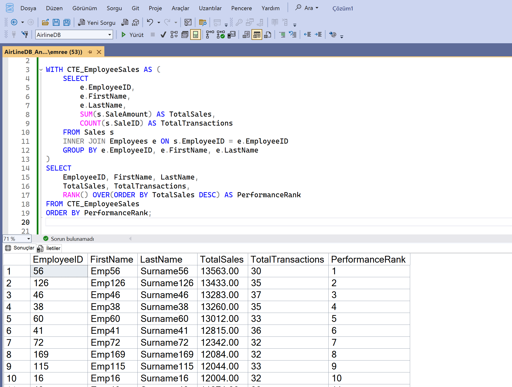
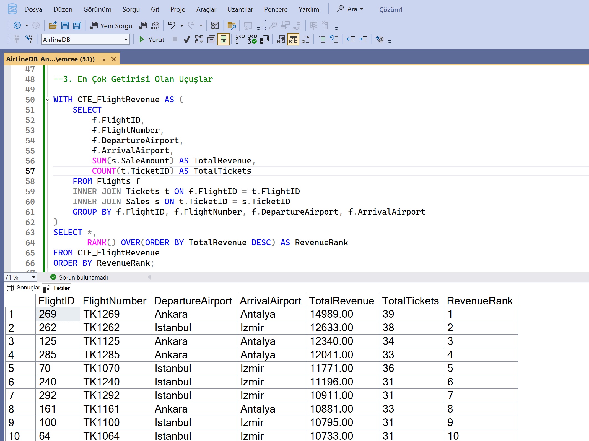
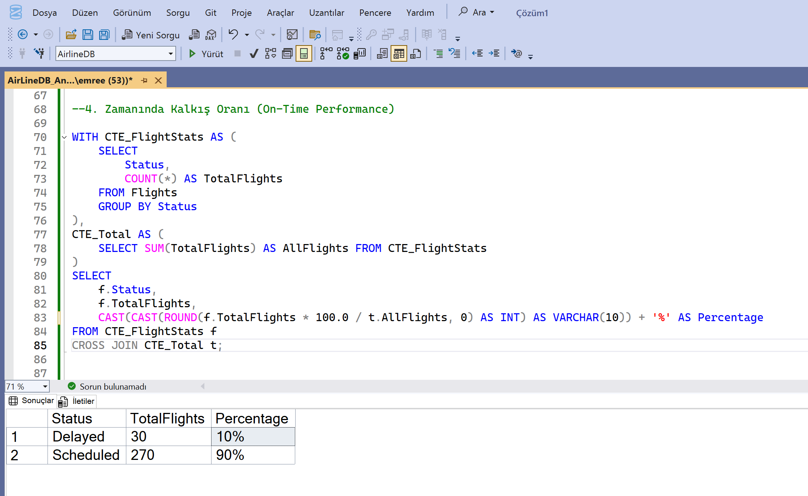
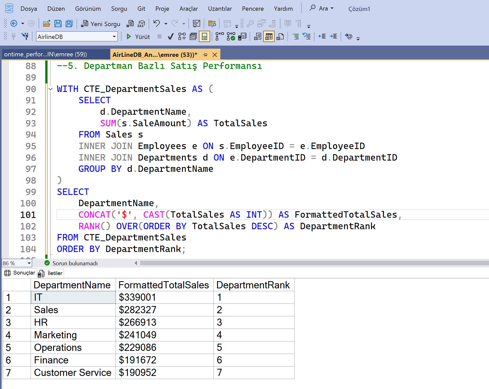
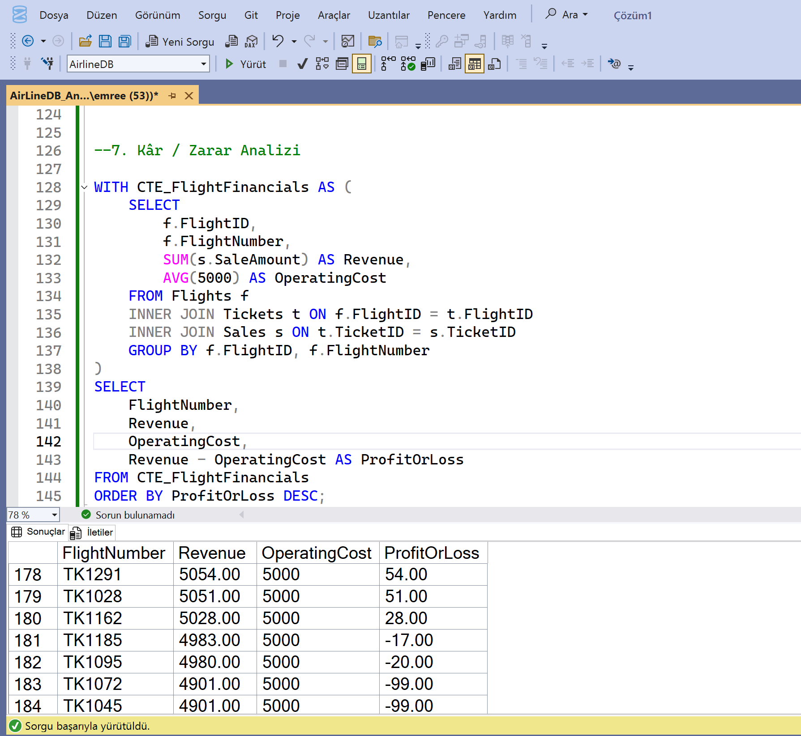

# Airline Analytics SQL Project ✈️

Bu proje, bir havayolu şirketi için **SQL tabanlı analitik raporlama** ve **görselleştirme** örneğini sunar.  
Proje kapsamında veritabanı şeması, örnek veri seti, SQL sorguları ve görsel raporlar bulunmaktadır.

## 📌 Proje Yapısı
```
Airline-Analytics-SQL/
│
├── README.md
├── schema/
│   └── AirlineDB.sql         # DB şeması (Departments, Employees, Flights, Customers, Tickets, Sales)
├── data/
│   └── sample_inserts.sql    # 200 çalışan, 1000 müşteri, 3000 bilet, 5000 satış vb.
├── queries/
│   ├── employee_performance.sql
│   ├── customer_segmentation.sql
│   ├── flight_revenue.sql
│   ├── ontime_performance.sql
│   ├── department_sales.sql
│   ├── loyalty_analysis.sql
│   ├── profit_loss.sql
│   └── all_queries.sql        # Hepsinin birleşimi
└── reports/
    └── screenshots/           # ERD + Query çıktıları
```


---

## 🚀 Kullanım
1. `schema/AirlineDB.sql` dosyasını çalıştırarak veritabanını oluştur.
2. `data/sample_inserts.sql` ile örnek verileri yükle.
3. `queries/` klasöründeki SQL dosyalarını çalıştırarak raporları al.
4. `reports/screenshots/` klasöründe ilgili görselleri incele.

---

## 📊 Görseller

### 1️⃣ ERD Şeması


### 2️⃣ Satış Performansı (En çok satış yapan çalışanlar)


### 3️⃣ En Çok Getirisi Olan Uçuşlar


### 4️⃣ Zamanında Kalkış Oranı


### 5️⃣ Departman Bazlı Satış Oranı


### 6️⃣ Kar/Zarar Analizi


---

## 🎯 İçerik
- **Çalışan performansı** → En çok satış yapan çalışanlar
- **Müşteri segmentasyonu** → Yaş, gelir, uçuş sıklığına göre analiz
- **Uçuş gelir analizi** → En yüksek getirili uçuşlar
- **Zamanında kalkış oranı** → Uçuş güvenilirliği
- **Departman satış raporu** → Departman bazlı gelir katkısı
- **Sadakat analizi** → Müşteri bağlılığı
- **Kar/Zarar tablosu** → Genel finansal tablo

---

✍️ Hazırlayan: **Emre Engin**  
🔗 GitHub Repo: [AirLinesDB](https://github.com/BlackRazor34/AirLinesDB)


